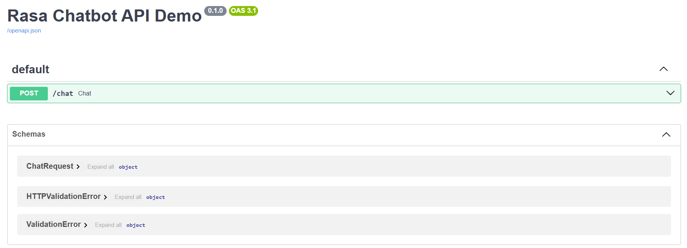
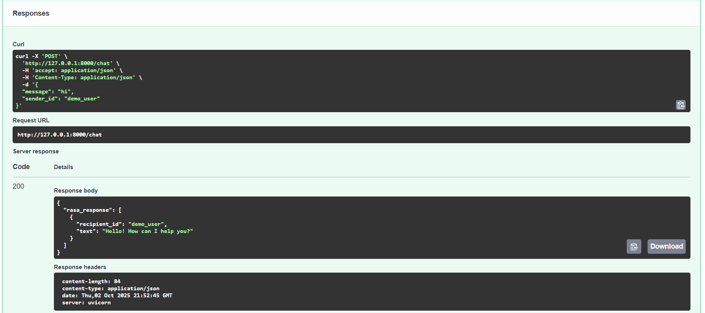
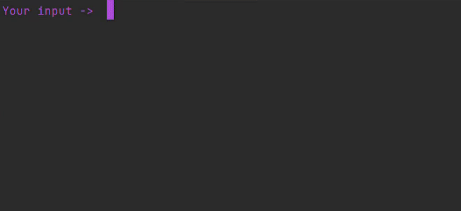

# Rasa + PostgreSQL Dummy Bot

A tiny Rasa chatbot prototype running in Docker, storing conversations in PostgreSQL.

---

## What it does

- Handles 4 intents: `greet`, `ask_help`, `out_of_scope`, `goodbye`.
- Replies with simple responses (utterances).
- Stores all messages in a PostgreSQL tracker store.
- Default reply for unknown input.

---

## Quick Demo

### Swagger UI

Main page:

Try it out with a chat request:

### Chat Demo GIF

> All messages get saved in the DB.

---

## Notes

- Stories/rules are minimal and consistent.
- Runs via Docker Compose: Rasa + Action Server (not used currently) + PostgreSQL.

---

## Tech

- Rasa  
- Python  
- PostgreSQL  
- Docker / Docker Compose
- FastAPI
